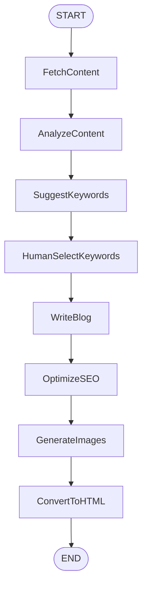

# Cast: Blog Writer

웹사이트 URL 기반 블로그 포스트 자동 작성

## 개요

| 항목 | 값 |
|------|------|
| **목적** | URL의 웹 콘텐츠를 분석하여 SEO 최적화된 블로그 포스트 생성 |
| **패턴** | Sequential + Human-in-the-loop |
| **레이턴시** | 중간 (1-3분) |

## 아키텍처 다이어그램



## 상태 스키마

### InputState (BlogRequest)

```python
class BlogRequest(BaseModel):
    url: HttpUrl                           # 참고할 웹사이트 URL
    user_keywords: list[str] | None = None # 사용자 지정 키워드 (선택)
```

### OutputState (BlogResponse)

```python
class SEOMeta(BaseModel):
    title: str
    description: str
    
class BlogResponse(BaseModel):
    html_content: str              # 이미지 포함 HTML 블로그
    suggested_keywords: list[str]  # 제안된 키워드 3개
    selected_keywords: list[str]   # 선택된 키워드
    seo_meta: SEOMeta             # SEO 메타 정보
    image_urls: list[str]         # 생성된 이미지 URL들
```

### OverallState (BlogState)

```python
class BlogState(TypedDict):
    # Input
    url: str
    user_keywords: list[str] | None
    
    # Processing
    raw_content: str              # 수집된 웹 콘텐츠
    analyzed_content: dict        # 분석된 핵심 내용
    suggested_keywords: list[str] # 제안된 키워드
    selected_keywords: list[str]  # 선택된 키워드
    blog_markdown: str            # 블로그 마크다운 초안
    image_urls: list[str]         # 이미지 URL들
    
    # Output
    html_content: str             # 최종 HTML
    seo_meta: dict               # SEO 메타
```

## 노드 명세

| 노드 | 설명 | 입력 | 출력 |
|------|------|------|------|
| `FetchContent` | URL에서 웹 콘텐츠 수집 (BS4/Playwright) | url | raw_content |
| `AnalyzeContent` | 핵심 내용 분석 및 요약 | raw_content | analyzed_content |
| `SuggestKeywords` | 키워드 3개 제안 | analyzed_content, user_keywords | suggested_keywords |
| `HumanSelectKeywords` | 사용자 키워드 선택 (interrupt) | suggested_keywords | selected_keywords |
| `WriteBlog` | 블로그 마크다운 작성 | analyzed_content, selected_keywords | blog_markdown |
| `OptimizeSEO` | SEO 메타 정보 생성 | blog_markdown, selected_keywords | seo_meta |
| `GenerateImages` | 이미지 생성/수집 | analyzed_content | image_urls |
| `ConvertToHTML` | 최종 HTML 변환 | blog_markdown, image_urls, seo_meta | html_content |

## 기술 스택

### 의존성 패키지

```toml
[project.dependencies]
langchain-openai = "*"
langchain-anthropic = "*"
langchain-google-genai = "*"
beautifulsoup4 = "*"
playwright = "*"
openai = "*"       # DALL-E
httpx = "*"        # Unsplash/Pexels API
markdown = "*"     # MD to HTML
```

### 환경 변수

```bash
# LLM (사용자 선택)
OPENAI_API_KEY=
ANTHROPIC_API_KEY=
GOOGLE_API_KEY=

# Image Generation (사용자 선택)
STABILITY_API_KEY=
UNSPLASH_ACCESS_KEY=
PEXELS_API_KEY=
```

## 설정 스키마

```python
class LLMProvider(str, Enum):
    OPENAI = "openai"
    ANTHROPIC = "anthropic"
    GOOGLE = "google"

class ImageProvider(str, Enum):
    DALLE = "dalle"
    STABILITY = "stability"
    UNSPLASH = "unsplash"
    PEXELS = "pexels"

class ScraperType(str, Enum):
    BEAUTIFULSOUP = "beautifulsoup"
    PLAYWRIGHT = "playwright"

class BlogWriterConfig(BaseModel):
    llm_provider: LLMProvider = LLMProvider.OPENAI
    image_provider: ImageProvider = ImageProvider.DALLE
    scraper_type: ScraperType = ScraperType.BEAUTIFULSOUP
```
